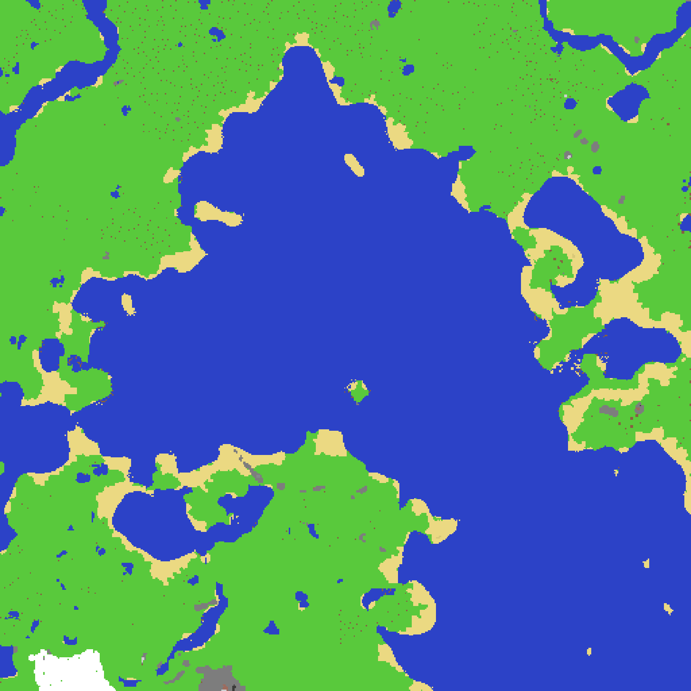
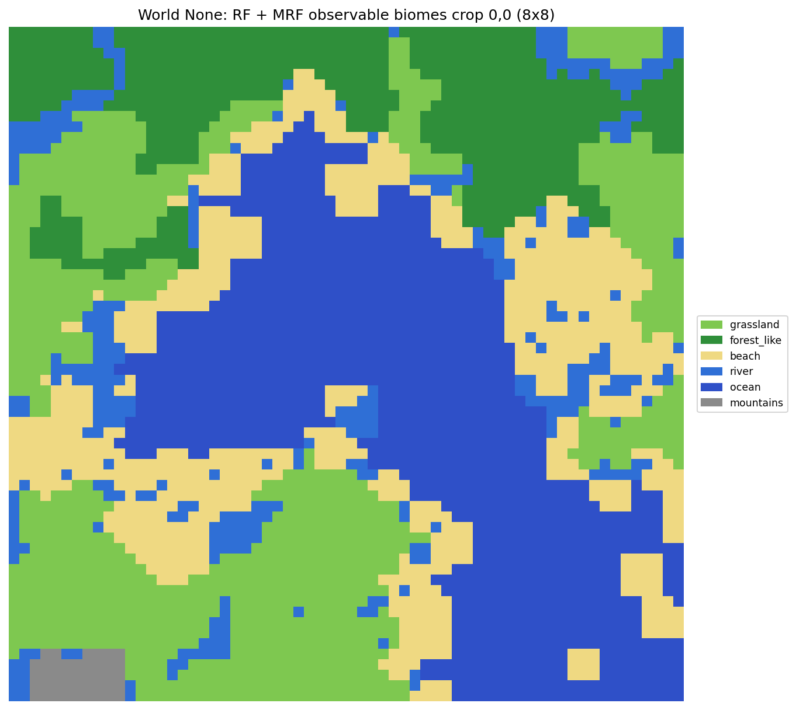
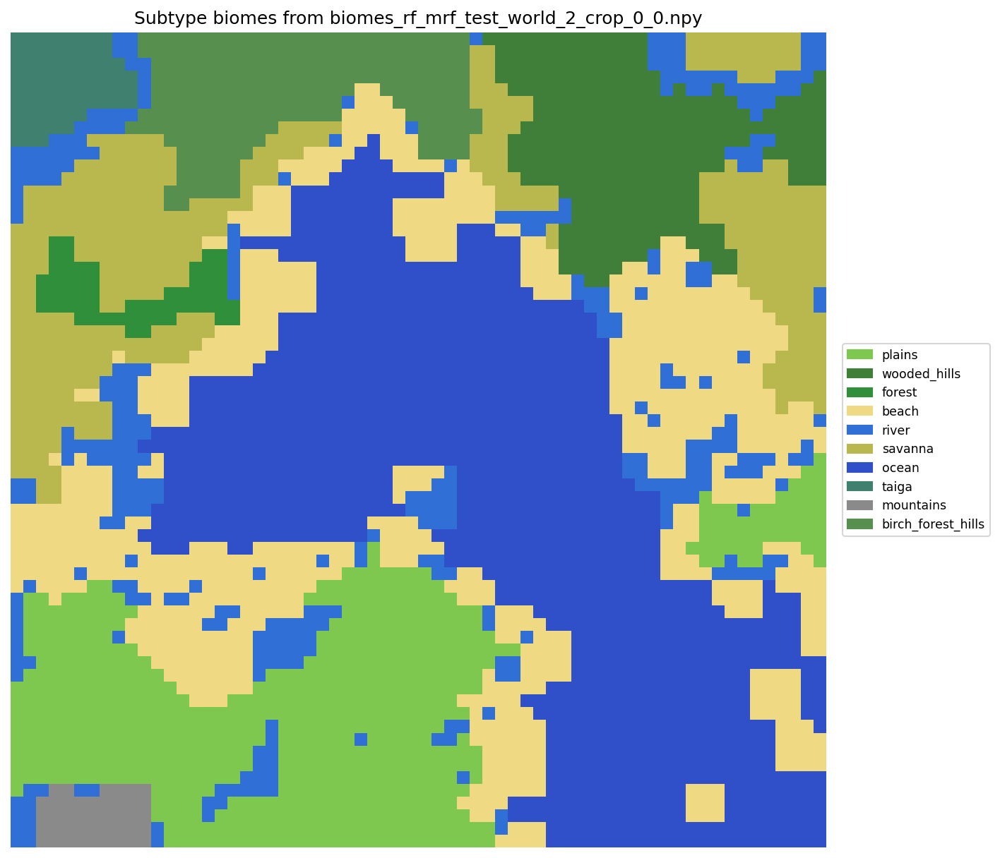
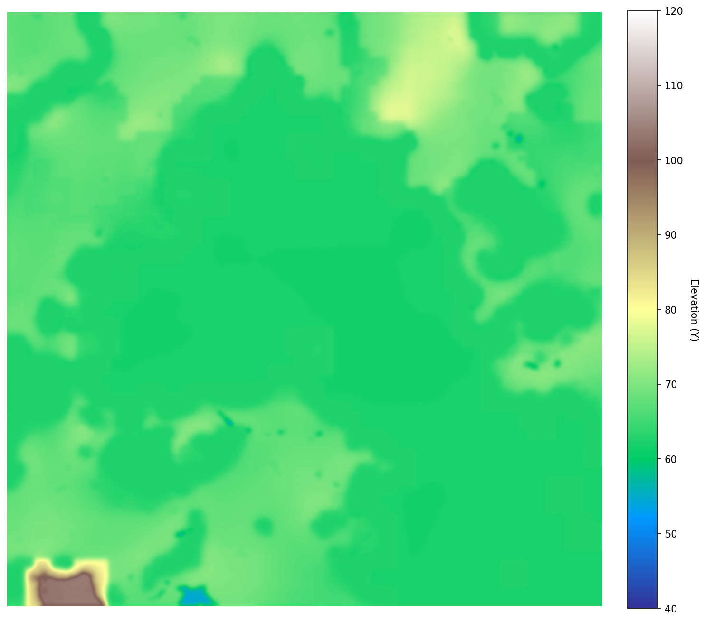

# Minecraft 512x512 Region Surface Generation with Machine Learning

This project uses Machine Learning to procedurally generate custom Minecraft 512x512 region surfaces from scratch. The pipeline involves predicting surface structure and biomes using Gaussian Mixture Models (GMM), Random Forests, and Markov Random Fields (MRF). A U-Net architecture is then used to predict a realistic heightmap based on the generated biomes. Finally, vegetation is placed according to biome rules, and the complete data is exported into the Minecraft `.mca` (Anvil) region format, allowing the generated terrain to be loaded directly into the game.

## Showcase (Pregenerated Worlds)

To allow exploring generated worlds without needing to set up the environment and run the machine learning models, we have included three pregenerated worlds in the `showcase_worlds/` directory:
- **`test_world_1`**
- **`test_world_2`**
- **`test_world_3`**

You can copy the `.mca` region files from `showcase_worlds/[world_name]/regions/` directly into a Minecraft save folder to explore them. Detailed instructions are provided below.

## Visualizations (Test World 2)

Here are the visualizations generated for `test_world_2`, illustrating the intermediate and final steps of the generation pipeline:

### Surface Patches


### Base Biomes Prediction


### Biome Subtypes Assignment


### Predicted Heightmap (U-Net)


Here is the 6-step generation pipeline represented as a Mermaid diagram (rendered natively by GitHub):


## How to Play a Showcase World or Generate a New One

### Option A: Play a Pregenerated Showcase World (Fastest)

To explore one of our pregenerated worlds (`test_world_1`, `test_world_2`, or `test_world_3`) without running the model pipeline:

1. Launch Minecraft, click **Singleplayer** $\rightarrow$ **Create New World**.
2. Set **Game Mode** to **Creative**, and configure the world settings as needed (e.g. click **Done** twice if prompt options appear). Click **Create New World**.
3. Once spawned, exit the world (**Save and Quit to Title**).
4. On Windows, press the Start menu, type `%appdata%` in the search bar, and open this folder.
5. Navigate to: `.minecraft` $\rightarrow$ `saves` $\rightarrow$ `[name of the world you just created]` $\rightarrow$ `region`.
6. Delete all files in the `region` folder, and copy all `.mca` files from `showcase_worlds/[world_name]/regions/` into this folder.
7. Open Minecraft again and load your world. The pregenerated ML-terrain will load correctly and be ready to explore!
8. **Note on Spawning**: The game might spawn your character at height zero ($Y=0$) inside solid stone. If this happens, fly up about 100 blocks or run:
   ```mcfunction
   /tp ~ ~100 ~
   ```

---

### Option B: Generate and Play a New World

To generate a completely new world from scratch using the machine learning models:

> [!IMPORTANT]
> **Git LFS Required:** Since this option runs the ML pipeline, you will need the model checkpoints (e.g. Random Forest and U-Net weights). These are stored using [Git LFS](https://git-lfs.com/). Make sure you have Git LFS installed on your system and run `git lfs pull` to download the weights before running the generation script.

1. Activate your Python virtual environment and execute the generator pipeline:
   ```bash
   python generate_world.py [new_world_name]
   ```
   This will run the full generation pipeline (GMM/MRF, RF, U-Net, Vegetation, MCA export) and save the files to `worlds/[new_world_name]/`.
2. Follow steps 1-8 from **Option A** above, but copy the `.mca` files from your newly generated directory `worlds/[new_world_name]/regions/` instead of `showcase_worlds/`.

---

> [!TIP]
> **Quick Vegetation Growth:** Since trees in our generated worlds are placed as saplings, you can run the following command in-game to make them grow into trees immediately:
> ```mcfunction
> /gamerule randomTickSpeed 3000
> ```
> *(Don't forget to set it back to `/gamerule randomTickSpeed 3` once they have grown!)*
